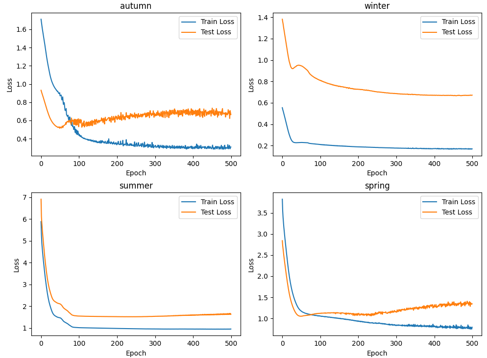
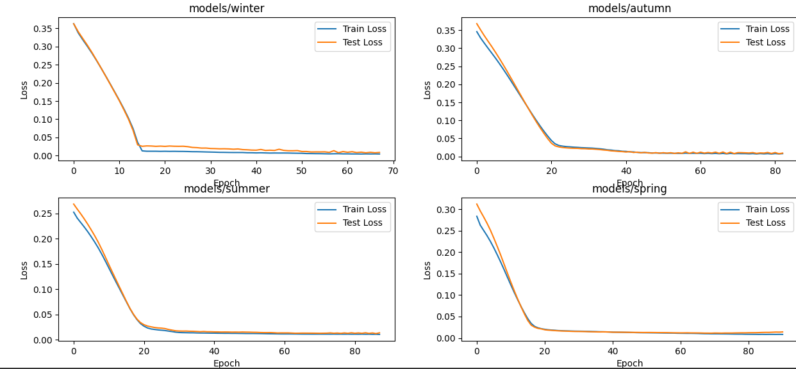

#  Readme BwKI

### Info
This is the submission for the project
```
solar-predict 
```
developed by bw-ki username zxp

## Instructions
Please create an .env file
```shell
Long=
Lat=
Senec_Email=
Senec_Pass=
```

Download the data
```shell
python3 downloadData.py
```

Run the data preprocessing
```shell
python3 dataloader.py

```

Train the model
```shell
python3 train_lstm.py
```


## Development
The model went through many iterations and I started with a simple MLP based model     
that outperformed most other models until the end. 
In this picture you can see the performance of the mlp based model in it's early stages

MLP performance early stages ( after normalization etc. )


It seems that the biggest contribututing factor was not the model architecture, though that improved   
performance by a good bit at the end but rather the data preprocessing.
One of the biggest improvemenst could be recognized after normalizing the data ( both input and output)    
and adding more solar irradiance values. These seem to be big contributure to solar yield.

Loss progression before normalizing ( MLP )


Loss progression after normalization


One model architecture I tried that might be of interest to you is the transformer based model.   
Suprisingly the Transformer model seemed to paltaue at 17% loss for both test and training.
After observing that, I was able to find answers to my questions in this paper [paper](https://arxiv.org/abs/2205.13504). 
The results the paper discusses were also visibile in my experiments. The simple  MLP based model seemed to reliably outperform the Transformer model.

#### Latest model
The latest model went through many iterations. Finding out the optimal hyper parameters like lstm size, num_layers and window size consumed a lot of time and can be improved on.   
Currently after roughly 1000 epochs the models start to overfit and there is little improvement in test evaluation.
Another question I was not able to answer conclusivly is wether using the labels as input to the yield window during training is more benificial than using the actuall network output.


